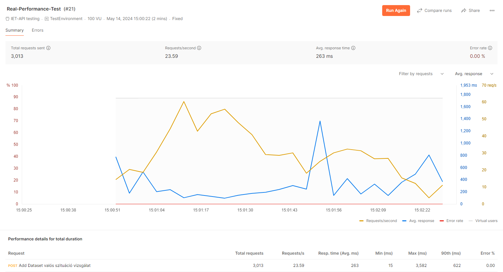
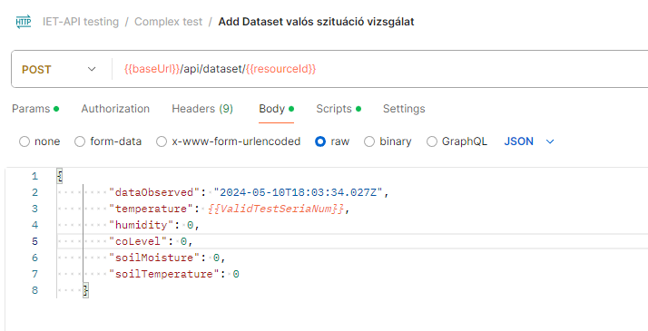
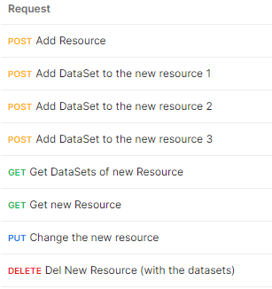
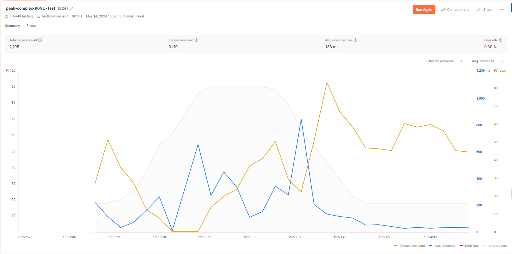

# **Teljesítmény tesztek**

## Általános információk

### A tesztek célja

Jelen teljesítmény tesztek célja, hogy egy általános átfogó képet kapjunk a IIOT WEBAPPLIKÁCIÓ GOMBATERMESZTŐ HÁZAKHOZ nevű egyetemi projekt Backend API-jának képességeiről.

### A projektről

A webapplikáció gombatermesztő házak és az azokban elhelyezett műszerek által mért értékek menedzseléséhez, kiértékeléséhez, és megtekintéséhez biztosít grafikus felületet a felhasználók számára. Minden ház 5 darab szenzort tartalmaz, melyek különböző értékeket mérnek. A gombaházak a rendszerben resource-ként, míg a házakhoz tartozó egyes időpontokban történt, szenzoradatok dataset-ként szerepelnek.  

### Tesztelő alkalmazás

A tesztek a Postman API platform V11 verzióján kerülnek elvégzésre. A Postman egy általános API tesztelő eszköz mejnek segítségével, könnyen lehet HTTP API kéréseket létrehozni,tesztelni és dokumentálni. 

A Postman rendelkezik beépített teljesítmény tesztelő modullal, ahol különbőző API kérések un. Collectionjait futtathatjuk, Performance módban, ahol számos beállítást tudunk megadni.

A teljesítmény tesztek virtuális felhasználókat szimulálnak amik a teszt ideje alatt az adott collectionban lévő HTTP kéréseket küldik folyamatosan és egymással párhuzamosan.

A postman teljesítmény tesztelő felülete

### Tesztelő környezet

A project dockerizálva van ezáltan mindenhol kényelmesen futtatható. A tesztek is ezen a dockerizált verzión kerülnek elvégzésre.

A tesztkörnyezet fel van töltve mock adatokkal, a teszteléshez megfelelő mértékben.

A dockerben futó project

### A tesztelő számítógép adatai

A tesztelő gép adatai az alábbiak:
    8 CPU mag
    8GB RAM
    
A Postman ilyen hardver mellett egyszerre maximum 100 virtuális usert tud szimulálni, a projekt jellege, okán azonban már ez is bőségesen sok, ahoz képest amit "élesben tapasztalhatunk".

### Teljesítmény mérési metrikák

A fő metrikák a kiadott kérések száma és az átlagos válaszidő (és ennek növekedése a terheléssel párhuzamosan), valamint a hibával vissza érkező kérések százalékos aránya lesz.

Ezeket a postman mind grafikonok mind mérési adatok formájában prezentálja számunkra.

## API Végpontok Tesztelése

A teszteseteket a korábban említett módon, a Postman segítségével végezzük. A tesztesetek futtatása előtt **200 *Resource*** adatot vettünk fel mesterségesen, hogy a tesztek életszerűbbek legyenek.

Az API *Resource*-okra vonatkozó azon végpontjait fogjuk stressz tesztelni, melyek az **összes adatot lekérik, új *Resource*-t adnak az adatbázishoz**. Ezen túl tesztelni fogjuk az API *DataSet*-re vonatkozó azon végpontját is, mely az adott model osztályokhoz **kapcsolja a hozzájuk tartozó *Resource* osztályt** is.

A teszt adatok minden különálló teszteset futtatása előtt visszaállításra kerülnek.

A tesztek során a felhasználók számának változását különböző függvények írják le. Mi most 4 ilyen függvényt fogunk használni.
- A felhasználók számának fokozatos emelése - **Ramp Up**
- A felhasználók számának hirtelen megugrása, majd csökkenése - **Spike**
- A felhasználók számának hirtelen ugrása, bizonyos időintervallumig a csúcson maradása, majd hirtelen csökkenése - **Peak**
- A felhasználók száma egyenletes a teljes mérés alatt - **Fixed**

A tesztek alapesetben **60 másodpercig tartanak**. 

A **Ramp Up** tesztesetek mindig a maximum felhasználók 10%-ról indulnak 10 másodpercig ez marad a terhelés, majd 20 másodperc alatt elérik a maximális felhasználó számot. Ez után 30 másodpercig ennyi felhasználó folytonos kéréseit szolgálja ki a rendszer.

A **Spike** tesztesetek a maximális felhasználószám 30%-áról indulnak, 25 másodpercig így marad. Ez után 5 másodperc alatt felugrik a maximális felhasználó számra, majd 5 másodperc után visszacsökken annak 30%-ára, és így marad 25 másodpercig.

A **Peak** tesztesetek a maximális felhasználó szám 20%-áról indul, majd fokozatosan felemelkedik a maximális felhasználó számra, megtartja a maximális felhasználó számot és utána fokozatosan lecsökken a kiinduló értékre, amit szintén megtart. Ennek a teszteset típusnak minden szakasza 12 másodpercig tart.

A **Fixed** tesztesetek teljes időhosszban az előre meghatározott felhasználó számmal futnak.

Adatok változását az adatbázis rendszer online felületén érjük el, tartjuk számon.

### 1. Végpont teszt - Minden *Resource* lekérése (GET)

A kéréseket az */api/resource/all* végpontra küldjük.

#### Ramp Up

- **maximum 10 felhasználóval**: 
Kezdetben enyhe ingadozás megfigyelhető, ami után azonban gyorsan stabilizálódik a rendszer.

- **maximum 50 felhasználóval**:
Enyhe ingadozás figyelhető meg a felhasználók számának növekedésének elkezdésekor. A rendszer ebben az esetben nem stabilizálódik a másik esetben látott szinten, a maximális felhasználó szám elérése után is akár 60ms-os kilengések megfigyelhetőek.

Alábbi ábrán látható a két eltérő konfiguráció. Szagatott vonallal van jelezve az 50 felhasználós beállítási opció, a folytonossal a 10. A szürke hátterű trapézok jelölik a virtuális felhasználók aktuális számát. Az ábra alatt a 10 felhasználós eset adatai tekinthetőek meg, melyek mellett látható az eltérés az 50 felhasználós esettől.

Talán érdemes kiemelni, hogy az error rate mind a két esetben 0% volt, illetve hogy a maximális késleltetés 50 felhasználó esetén több mint 7x annyi volt mint 10 esetén. Átlagos válaszidő teljes mértékben kielégítő volt.

 #### Spike

A tesztesetet **50 maximális felhasználóval** végeztük. A kezdeti stabilizálódás után a késleltetés a felhasználók számának növekedésekor emelkedett.

Érdekes megfigyelni, hogy a korábban tapasztalt stabilizáció valamilyen mértékben itt is megfigyelhető, a késleltetés maximumát már az előtt eléri hogy a felhasználók száma elérte volna az 50-et, hamarabb elkezd csillapodni.

 #### Peak

Talán elsőre megtévesztő lehet, hogy a késleltetés grafikon csupán egy helyen ugrik meg és gyorsan lecsökken; azonban fontos megfigyelni a késleltetés dimenzió skálázását. Itt a maximális késleltetés a 7000 ms-ot is túllépi, ekkor az átlag is sokkal nagyobb értékeket vesz fel mielőtt visszacsillapodik elfogadható szintekre. 

### 2. Végpont teszt - Adott azonosítójú *Resource* lekérése (GET)

A kéréseket az */api/resource/{{resourceId}}* végpontra küldjük.

Ez az eset nagyon hasonlítana az előzőhöz, csupán minden request csak egyetlen adatot adna vissza. Ezért itt csak demonstrációs jelleggel a **Ramp Up** opciót teszteltük 50 felhasználóra.

#### Ramp Up
 
Maximum 50 és 10 felhasználóval tesztelve látható, hogy a korábbi eredményre kísértetiesen hasonlító. A terhelés hasonló pontjain a késleltetés hasonló ingadozáson megy át, azonban itt az átlagos válaszidő töredéke lesz annak amit akkor kapnánk ha az összes adatot lekérnénk az API-tól.

### 3. Végpont teszt - Resource-hoz tartozó adatok lekérdezése (GET)

*/api/dataset/withresource/{resourceId}*

#### Ramp Up

Ezen lekérdezés esetén is csak a **Ramp Up** teszt opciót találtuk érdemesnek a dokumentációra. Itt is csupán adatok kerülnek lekérdezésre az API-tól. Itt egy resource-hoz több adatpont is tartozik, így hasonló eredményre számítunk, mint az összes adat lekérése esetén.

A tesztelés 50 felhasználó esetére történt.

A képen megfigyelhető, hogy a rendszer valóban hasonló átlagos válaszidőt kapott, az összes resource lekérése esethez.

### 4. Végpont teszt - Létező *Resource* módosítása (PUT)

A */api/resource/{resourceId}* végponton elérhető funkció.

Ez az első teszt, mely nem egy **Get**, hanem egy **Put** típusú lekérdezést hajt végre. Szerettünk volna egy ilyet is tesztelni, azonban az adatbáziskezelő rendszer a projektben elabsztrahálta a tranzakció kezelést a fejlesztőtől. Ez azért fontos, mert így arra kell számítanunk, hogy nem kapunk hibákat, azonban a válaszidő nagyobb lesz.

#### Ramp Up

50 felhasználó esetén végeztük a tesztet.

Itt érdemes megtekinteni, hogy ahogy felugranak a válaszidők "ramping" kezdetekor akkor az átlagos kérések száma lecsökken, a virtuális userek várakoznak a válaszra az új kérés előtt. Amikor ez a késleltetés csökken, akkor kérések száma ismét növekedni kezd, az eddig várakozó és az új felhasználók is elküldik kéréseiket a szervernek.

Megfigyelendő, hogy a maximális várakozási idő már itt is bőven túllépi az elfogadható határt.

### 5. Végpont teszt - Adott Resource-hoz Dataset-ek beszúrása (POST)

*/api/dataset/{{resourceId}}*

#### Fixed

100 Virtuális felhasználó folytonosan szúrta be az újabb és újabb DataSeteket adott Resourcehoz. 

A tesztet 100 virtuális felhasználóval végeztük, ami a tesztelésre használt hardver eszköz maximuma volt. Azért dupláztuk meg az eddig használt felhasználó számot, hogy szimuláljuk, ahogy a sok különböző gombaház beli eszköz mérési adatokat rögzít a rendszerben.

**Fontos:** Ezen tesztesetet a többivel ellentétben 2 percig futtattuk, kíváncsiak voltunk mennyire fogja leterhelni a rendszert ez az eset. Ennek a tesztnek a teljesítménye adja majd legnagyobb valószínűséggel a rendszer szűk keresztmetszetét teljesítmény szempontból, hisz ez a végpont lesz a legtöbbet használva.

*Fontos kiemelnünk, hogy ez messzemenően túlmutat azon a terhelésen aminek a rendszer a specifikációban körülmények között ki lenne téve. Egy gombaházban ugyanis nem 100 hanem jóval kevesebb műszer van, és nem folyamatosan rögzítenek mérési adatokat, hanem bizonyos időközönként.*

Ezekre a kérésekre a rendszer egész jól reagált stabilitás szempontjából, csak egy nagyobb ugrás látható a diagramon. A válaszidő maximuma most is kényelmetlenül magas lett; azonban ez majd nem okoz éles környezetben gondot mert ilyen nagyságrendű terhelésnek a rendszer sosem lesz kitéve.

Azért terheltük ennyivel jobban a rendszert ezen teszt során, mint éles helyzetben lenne terhelve, hogy jó képet kapjunk maximális teljesítőképességéről ennek a gyakran használt végpontnak.

### 6. Teszt - Komplex kéréssorozat tesztelése

Ezen test során, egy több kérésből álló parancssorozatot hajtott végre minden egyes virtuális user. Itt az volt a megfontolás, hogy lássuk a rendszer, hogyan tud kezelni  egymástól különböző rendeltetésű kéréseket párhuzamosan. A teszt felépítése ezért követi a létrehozás,lekérés,változtatás,törlés sorrendet, hogy például mikor az egyik user törölni akar a másik pedig módosítani akkor milyen változások történnek perfomancia szempontból.

Lépéssorozat:

#### Peak

Azért Peak tehrelési ív melett döntöttünk mert így jobban megfigyelhetőek az esetleges elétérése.

A teszt peak időszakban 90 virtuális userrel futott míg a non-peak időszakban 18-al, ennek oka hogy feltudjuk nagyítani az esetlegesen jelentkező teljesítmény különbségeket.

Jó közelítéssel megfigyelhető, hogy a latency az újonnan belépő userek számával együtt növekszik. A peak pont elérése előtt azonban drasztikusan beesek mind a kiadott kérések száma, mind a latency, ám amíg az utóbbi hamar felugrik, addig az előbbi továbbra is 0. A rendszer valószínűleg ekkor terhelődött ezáltal, nem érkeztek válaszok a kiadott kérésekre így újakat sem tudott küldeni.

Különösen érdekes, hogy mikor a teszt második felében elkezd csökkeni a userek száma, a másodpercenként kiadott kérések száma növekedni kezd, és utána nem is csökken le a korábban látott módon. Ennek oka, hogy mivel kevesebb user küldi folyamatosan a kéréssorozat egyes elemeit, ezért csökken a latency aminek köszönhetően előbb tud a VU újabb kérést küldeni.

Ebből a tesztből megállapítható, az ami az 5-ös tesztből is levonható volt, hogy a rendszer 20-körüli gombaház esetén üzemel optimálisan.

## Tapasztalatok

### Get típusú kérések (1. - 3. Tesztesetek)

**A Get végpontokra vonatkozó tesztekkel beláthatóvá vált, hogy a rendszerünk maximum nagyjából 50 felhasználó jó minőségű kiszolgálására képes a GET típusú kérések esetén, ha a terhelés egyenletes jellegű.**

*Fontos kiemelnünk, hogy a tesztek során az 50 felhasználó folytonosan API kérésekkel sorozta a szoftvert és az eredeti feladatspecifikáció alapján már ennyi felhasználó kiszolgálására sem lesz soha szükség.*

**Ha javítani szeretnénk ezen az eredményen:**

- A backend technológiában megfontolandó lenne fejlettebb cache-elési, terhelés-elosztási és aszinkron technológiákat használni a jobb teljesítmény érdekében.

- Az API működése paging funkcionalitás segítségével is bővíthető.

- Ez a felhasználó szám természetesen növelhető lenne a hardver erőforrások bővítésével is.

### Put típusú kérések (4. Teszteset)

*/api/resource/{resourceId}*

Ezek a kérések is kielégítően kezeltek 50 vagy annál kevesebb felhasználót, amennyiben az átlagos válaszidőt használjuk mérési metrikának.

A maximális válaszidő azonban nagyon nagy volt ami már nem elfogadható QoS elvek szerint, a felhasználók nem akarnának sokat várni a válaszokra.

**Javaslatok:**
- Put request helyett több, különálló Patch kérést bevezetni az API-ba, mely lehetőséget ad csupán egyetlen mező módosítására adott objektumokban. Ez, a megfelelő implementáció mellett, eltüntetné a tranzakciókezelés miatti várakozások többségét. 

## Tapasztalatok a tesztelésről/vizsgálatról

### Kovács Zoltán

Érdekes volt megtapasztalni, ezt az eddig teljesen ismeretlen, oldalát a szoftver tesztelésnek/vizsgálatnak. Új volt, hogy alaposabb utána járás után kiderült mennyire fontos, a tesztek dokumentációja, nem csak a konkrét teszt esetek tekintetében hanem már magánál a tesztelő környezetnél és a kezdő beállításoknál is.

A használt szoftver (Postman) egy hatalmas pozitív csalódás volt. Nagyon ergonomikus a kialakítás szinte minden beállítás könnyen megtalálható valamint remek dokumentációt írtakhozzá. A különböző extra logika hozzáadásához kiváló a javascript nagyon könnyen lehet vele beállításokat végezni.

Egyetlen hátráltató tényező a performance tesztek limitált száma volt. Így a szoftver megismerése és az első tesztek lefuttatása után nem sok mozgástér maradt, ezért végeztünk csak ennyi tesztet.

### Szendrey Máté

Ez volt eddigi első projektem ahol ilyen mélységben végeztem teljesítmény tesztelést. A mérések jelentésénel kibogozása és ledokumentálása leginkább különböző adatbázis lekérdezés optimalizációs laborokra emlékeztetett. Hasonló mélységben kellett utána járni a rendszer mögöttes működésének.

A Postmanre eddig mint egy egyszerű primitív API tesztelő eszközre gondoltam. Kellemesen kellett csalódnom, mind ergonómiában, mind a különböző funkciók számosságában messze túlmutatott ezen a képen.

Visszatekintve örülök, hogy ezt az alfeladatot választottam, sokat tanultam belőle.

## Források

https://learning.postman.com/docs/introduction/overview/

https://qacraft.com/test-documentation-in-software-testing/

https://www.headspin.io/blog/a-performance-testing-guide

https://testsigma.com/blog/performance-testing/

https://learn.microsoft.com/en-us/dynamics365/guidance/implementation-guide/performing-solution-performance-testing-approach
