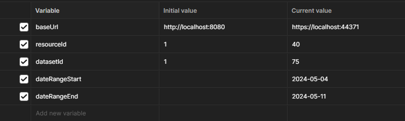
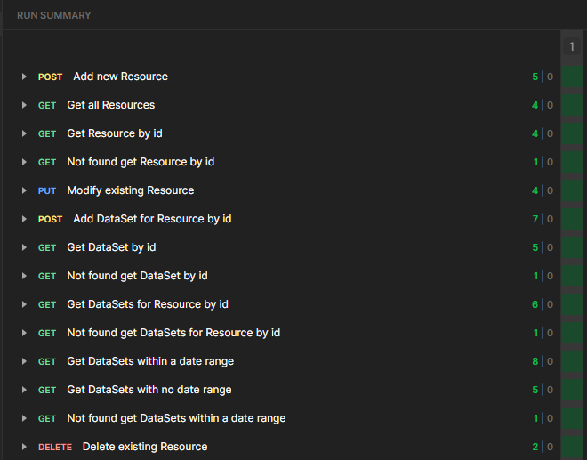
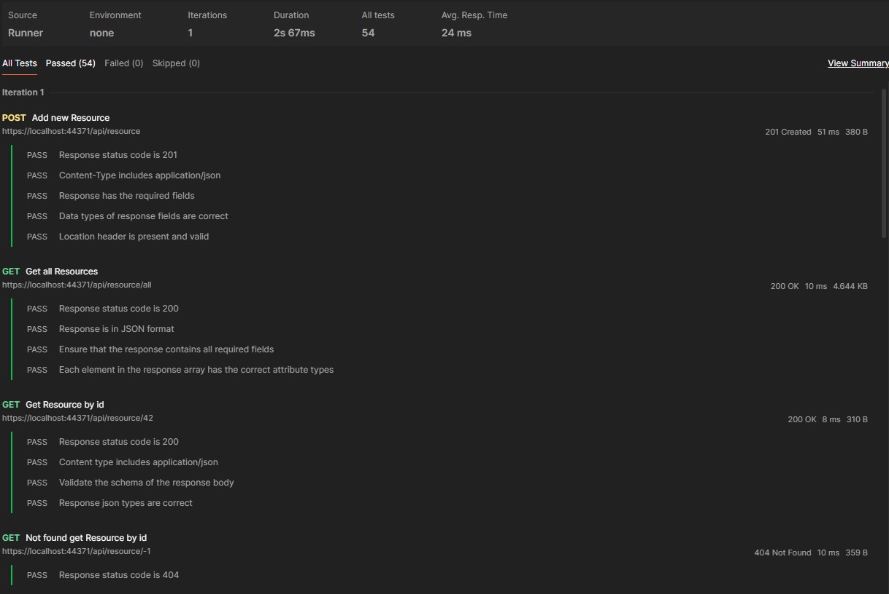
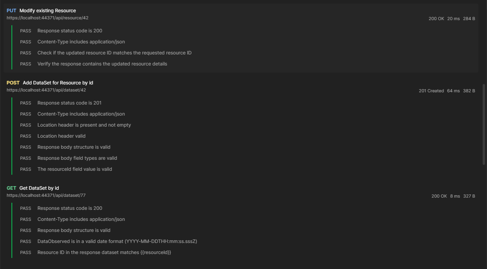
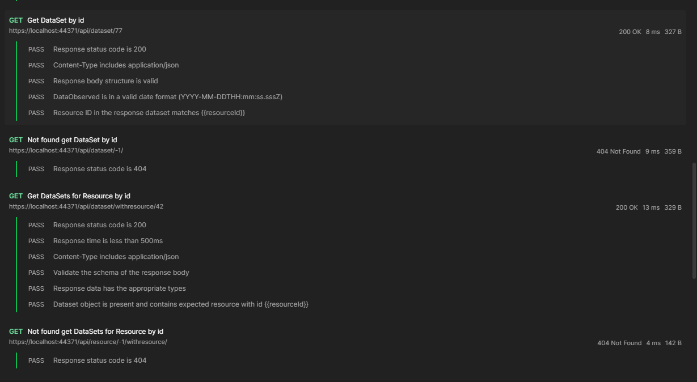
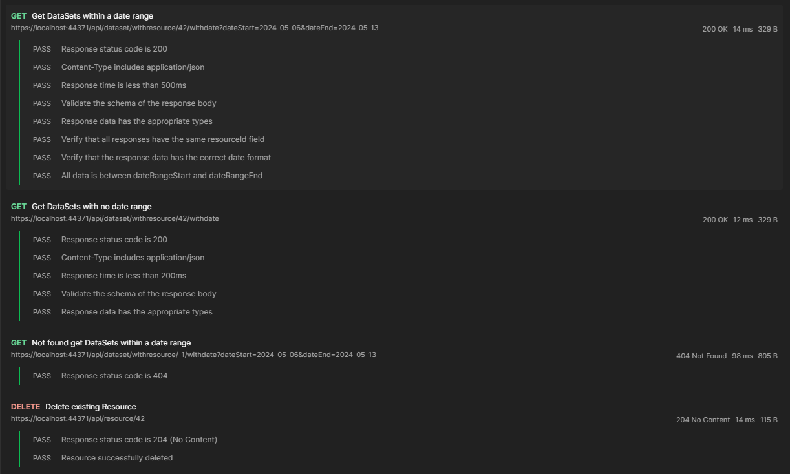
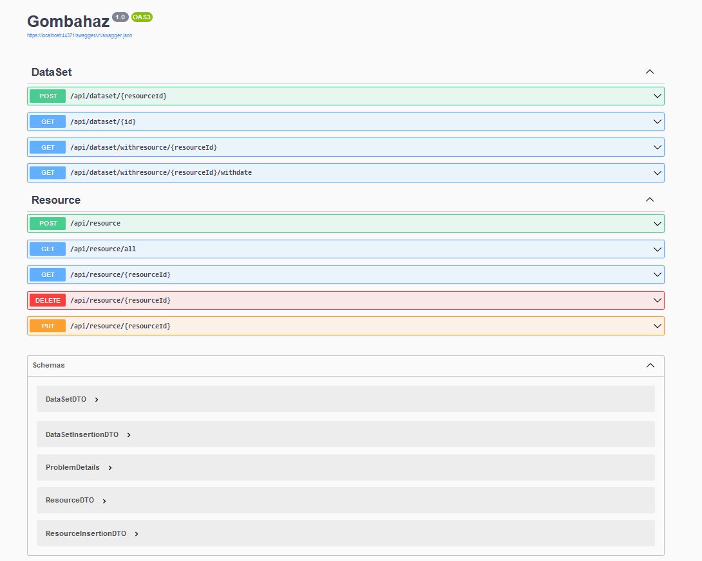

### API végpontok létrehozása

A feladatom első részeként Postman segítségével létrehoztam egy Collectiont, és abba két mappát - Resource és DataSet. Ezek a mappák aszerint csoportosítják a végpontokat, hogy melyik táblából kérnek le adatokat a backenden.

Az egyes mappákban pedig létrehoztam a végpontokat, ezek az alábbi képen láthatók:

_Megjegyzés_: Több végpont lett létrehozva annak érdekében, hogy olyan tesztek is lefuthassanak, amelyek a hibás kérés esetén visszadott válaszokra vonatkoznak.

Létrehoztam több Collection Variable változót is, mivel az összes kérés ugyanazt az URL-t használja, valamint hogy az egész Collection-re lehessen teszteket futtatni, ugyanis egyes kérések átállították a változókat.

### Tesztek megírása

Miután elkészültem a végpontok létrehozásával, utána az egyes API végpontokhoz tartozó teszteket megírtam.

A tesztek megírásában segítséget nyújtott a Postman dokumentáció, valamint a Postbot beépített AI copilot is.

A tesztek futtatása után hibákat fedeztem fel a backendben, ennek javításai láthatók GitHub-on issue-k formájában.

Jelenlegi állapotban, ha az alábbi sorrendben futtatjuk le a teszteket a Collection-ön (csak a Resource és DataSet mappába tartozó kéréseket), akkor a tesztek mindegyike sikerrel fog lezárulni.

**Fontos:** A DELETE kérésnek mindig a Collection run legvégén kell lefutnia.

A tesztek eredménye, pedig az alábbi képeken látható:

Ha a teszteket külön szeretnénk lefuttatni, akkor oda kell figyelni a Collection változókra, ugyanis egyes kérések megváltoztatják azokat, és ha erre nem figyelünk, akkor a tesztek hibával térhetnek vissza. (Például a DELETE többszöri meghívása anélkül, hogy POST-ot hívtunk volna)

### API leírása

Az API-hoz található a VisualStudio projekt által automatikusan készített Swagger leírás.

### Tanulság

Amit megtanultam ebben a házi feladatban az az, hogy a tesztelést komolyan kell venni, és el kell végezni, mert egy olyan projektben is előjöhetnek hibák, amiről a fejlesztő alapesetben úgy gondolta, hogy nagyrészt hibamentes. Továbbá rávilágított arra is a házi feladat, hogy a GitHub-ot hogyan kellene rendesen használni verziókezelésre.